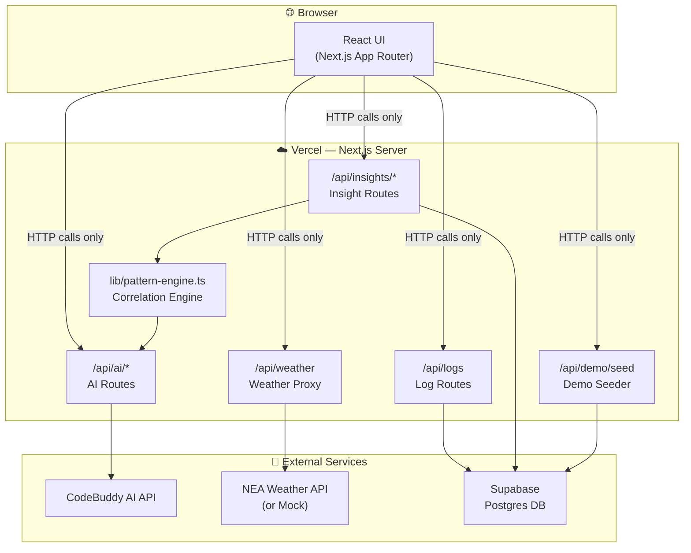
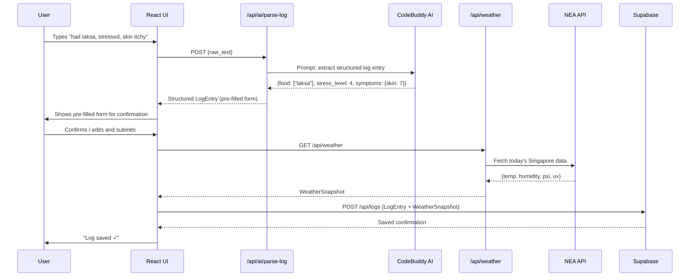
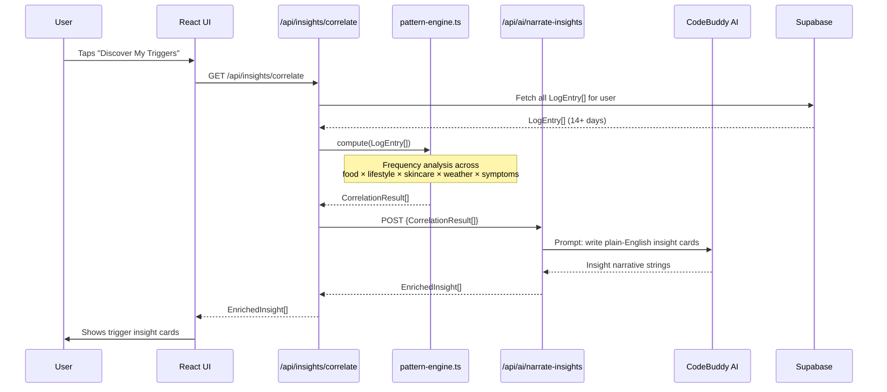
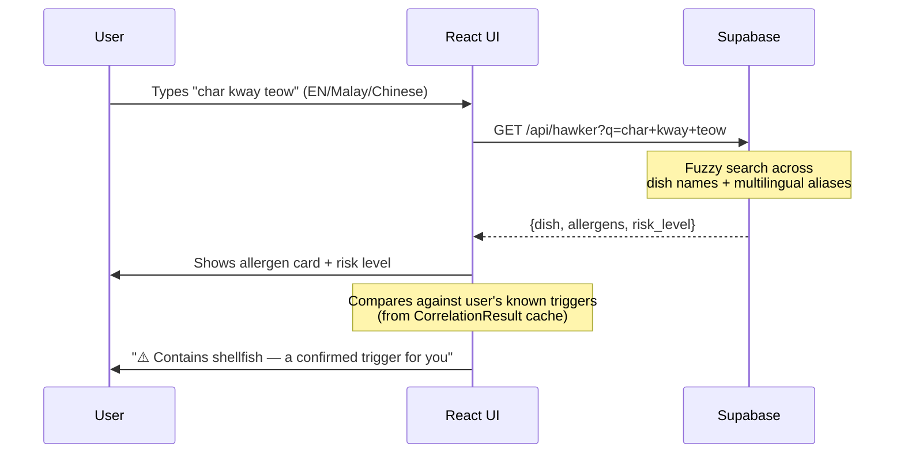
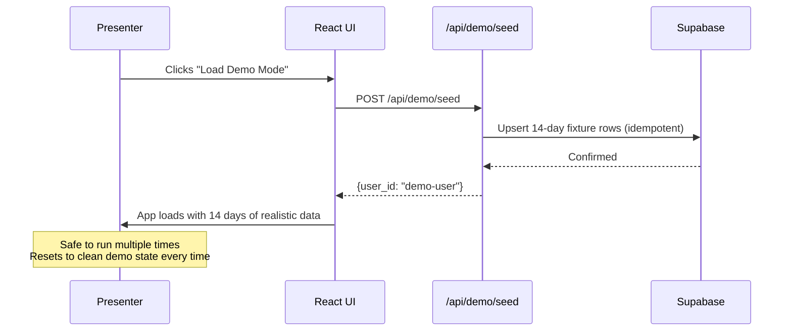
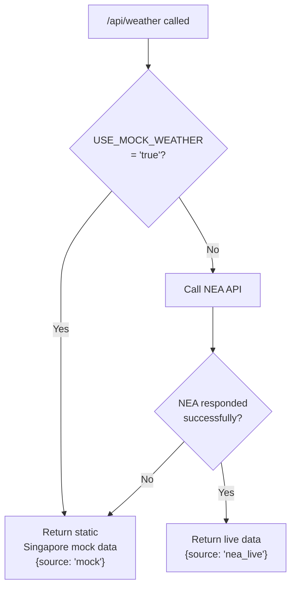
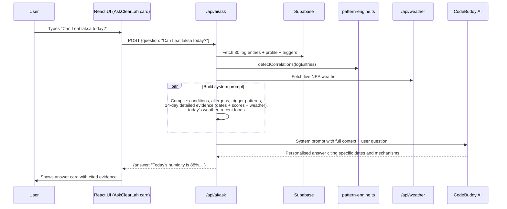
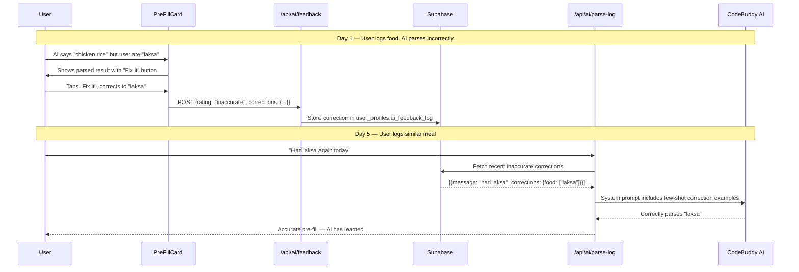
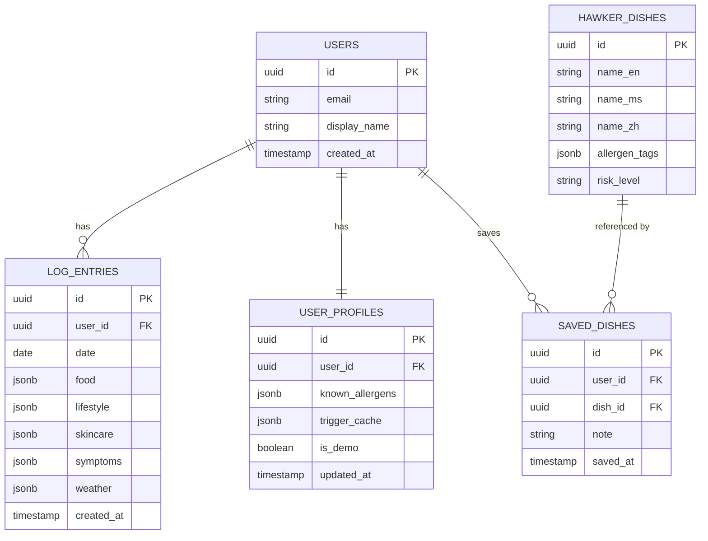

# ClearLah — Architecture Explainer

**Audience:** Hackathon judges, team members, and stakeholders
**Date:** 7 August 2026

---

## What We Built and Why

ClearLah is a personal eczema trigger tracker for Singapore. It helps users discover what causes their flare-ups by logging food, lifestyle, skincare, and symptoms daily — then using AI to surface the patterns.

The architecture is designed around three constraints:
1. **7 days to build** — every decision favours speed and reliability over sophistication
2. **Live demo on Day 7** — the system must not fail publicly; every external dependency has a fallback
3. **Built on CodeBuddy AI** — AI is a first-class citizen: the AI agent parses, reasons, learns from feedback, explains with evidence, and answers free-form questions

The AI agent is not a feature layer — it **is** the product. Four AI endpoints work together as an intelligent system: parsing natural language logs, narrating pattern insights with temporal reasoning, learning from user corrections via feedback, and answering free-text questions by cross-referencing personal data, live weather, and hawker dish knowledge.

---

## System Overview

At the highest level, ClearLah is a **Next.js full-stack application** deployed on Vercel, backed by a **Supabase database**, with two external integrations: the **CodeBuddy AI API** and the **NEA weather API**.



**The golden rule:** The browser never talks to external services directly. Every API key stays on the server.

---

## The Five Core Flows

### 1. Daily Log Entry

The most common user action — logging today's food, mood, skin state, and skincare products.



**Key design choice:** AI parses the free-text input into a structured form, and the user confirms accuracy with thumbs-up/down feedback. Corrections are stored and fed back as few-shot examples — the AI agent **learns** from every user interaction and improves over time.

---

### 2. Pattern Detection & Insight Generation

Run after 7+ days of data. This is the core intelligence of ClearLah.



**Key design choice:** JavaScript computes the maths; CodeBuddy AI writes the words. If AI is unavailable, the computed `CorrelationResult[]` is displayed using template strings — the demo never breaks.

---

### 3. Hawker Safety Check

User searches for a dish before ordering.



---

### 4. Demo Seeding

One-click demo setup for live presentations.



---

### 5. Weather Proxy with Fallback



The client always gets a `WeatherSnapshot` — it never knows whether the data is live or mocked.

---

### 6. Ask ClearLah — Conversational Agent Q&A

User asks free-text questions; the AI cross-references personal data, triggers, weather, and hawker knowledge:



**Key design choice:** The AI receives the user's actual 14-day log data (dates, foods, symptom scores, weather) so it can cite specific evidence rather than giving generic advice. This is what makes the agent feel intelligent — it references the user's real history.

---

### 7. AI Feedback Learning Loop

Every AI parse is rated; corrections feed back into future prompts:



**Key design choice:** Feedback is non-blocking — if the feedback API fails, the log save still proceeds. The AI improves passively over time, never breaking the core logging flow.

---

## Data Model



---

## Folder Structure

```
clearlah/
├── app/
│   ├── (app)/                    # Authenticated app shell
│   │   ├── dashboard/            # Home — streak, quick log, weather
│   │   ├── log/                  # Daily log entry flow
│   │   ├── insights/             # Trigger insights + correlation cards
│   │   ├── hawker/               # Hawker safety checker
│   │   └── export/               # PDF export
│   ├── api/
│   │   ├── ai/
│   │   │   ├── parse-log/        # POST — free-text → structured LogEntry (with feedback few-shot learning)
│   │   │   ├── narrate-insights/ # POST — CorrelationResult[] → insight text (with temporal reasoning)
│   │   │   ├── ask/              # POST — free-text Q&A cross-referencing logs + weather + hawker DB
│   │   │   └── feedback/         # POST — stores user corrections for AI learning
│   │   ├── weather/              # GET — NEA proxy with mock fallback
│   │   ├── logs/                 # GET/POST — log CRUD
│   │   ├── insights/
│   │   │   └── correlate/        # GET — run pattern engine
│   │   └── demo/
│   │       └── seed/             # POST — upsert 14-day fixture
│   └── layout.tsx
├── lib/
│   ├── pattern-engine.ts         # Pure TS — correlation logic, no I/O
│   ├── supabase/
│   │   ├── client.ts             # Browser Supabase client
│   │   └── server.ts             # Server Supabase client
│   └── types.ts                  # Shared type definitions
├── data/
│   └── demo-data.json            # 14-day realistic fixture
├── supabase/
│   ├── schema.sql                # Table definitions
│   └── seed.sql                  # 80+ hawker dishes
└── public/
```

---

## Technology Choices

| Layer | Choice | Why |
|---|---|---|
| Framework | Next.js 14 (App Router) | Full-stack in one repo; API routes solve proxy + AI calls; Vercel-native |
| Language | TypeScript (strict) | Catches data contract mismatches at compile time — critical with complex nested JSON |
| Styling | Tailwind CSS | Fast, consistent, no custom CSS to maintain |
| Database | Supabase (Postgres) | Free tier, instant setup, typed client, Auth built-in |
| AI | CodeBuddy AI API | Hackathon track requirement; server-side only |
| Deployment | Vercel | Zero-config Next.js; live HTTPS URL for demo |
| Pattern Detection | Custom TypeScript | Deterministic, testable, zero latency, no AI dependency for core logic |

---

## What Could Go Wrong (and What We Did About It)

| Risk | Mitigation |
|---|---|
| CodeBuddy AI is slow during demo | Pattern engine produces results independently; AI narration has a template fallback; Ask endpoint returns friendly degradation message |
| NEA API is unavailable | `USE_MOCK_WEATHER=true` env flag — flip it before the demo |
| Supabase free tier rate limits | Demo uses a single demo user; load is minimal |
| AI parses log entry incorrectly | User always sees and confirms the pre-filled form before saving; feedback learning improves accuracy over time |
| Demo data is corrupted | `/api/demo/seed` is idempotent — reset takes 2 seconds |
| AI answers feel generic, not personal | Ask endpoint pushes 14-day detailed evidence (dates, scores, weather) so AI cites specific user history |

---

## What's Not in MVP (and Why)

| Feature | Status | Reason |
|---|---|---|
| Multi-profile / family accounts | Post-hackathon | Complex auth + data isolation; not needed for demo |
| Wearable / passive data | Post-hackathon | Requires device APIs; out of 7-day scope |
| PDF export | Day 5 decision | Implement with `window.print()` CSS first; upgrade to `react-pdf` if time allows |
| Rate limiting on AI routes | Post-hackathon | Cost concern only; not a demo risk |

---

*Owner: Winston (Architect)*
*For implementation, see: `ClearLah-Architecture-Spine.md`*
*For product requirements, see: `ClearLah-PRD.md`*
